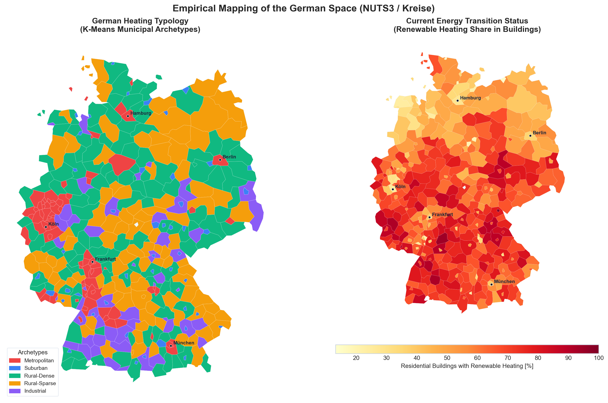
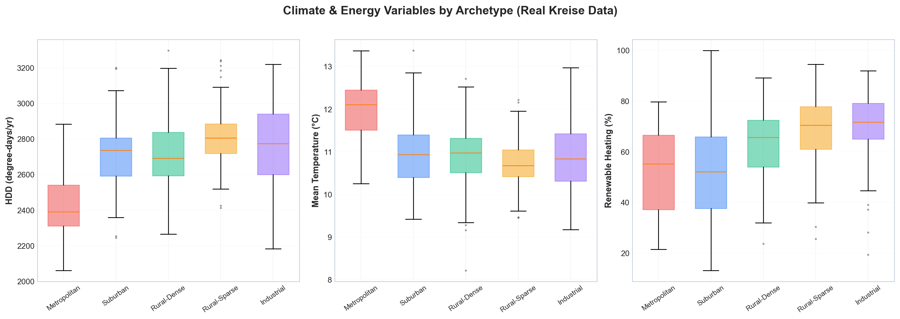
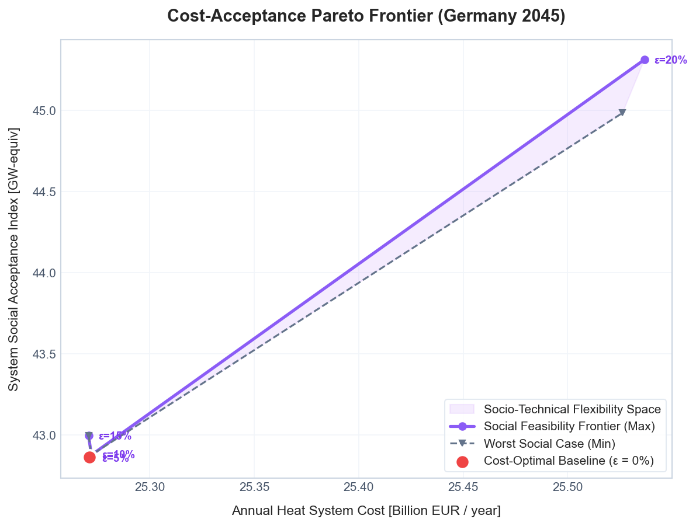
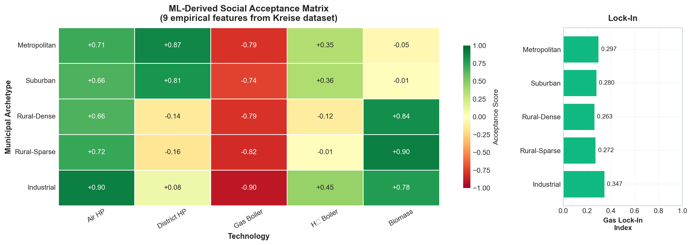
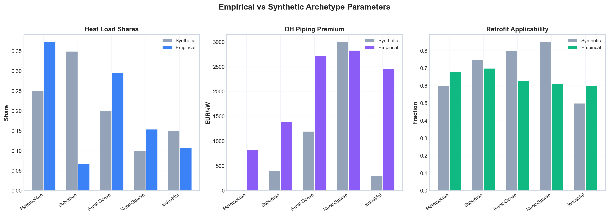
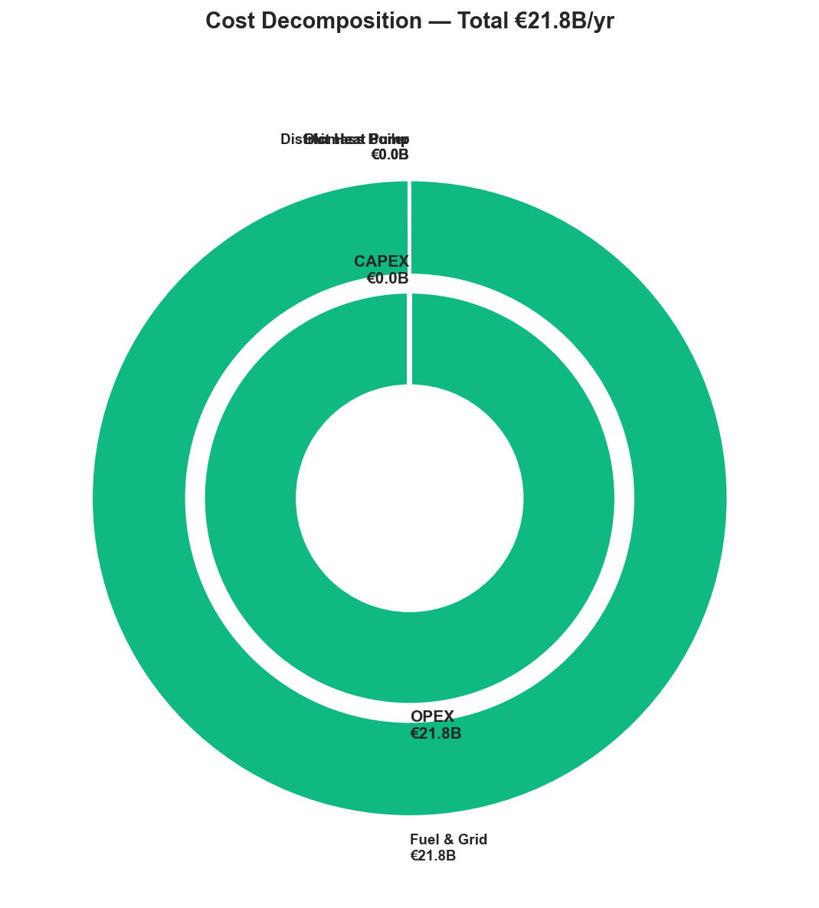
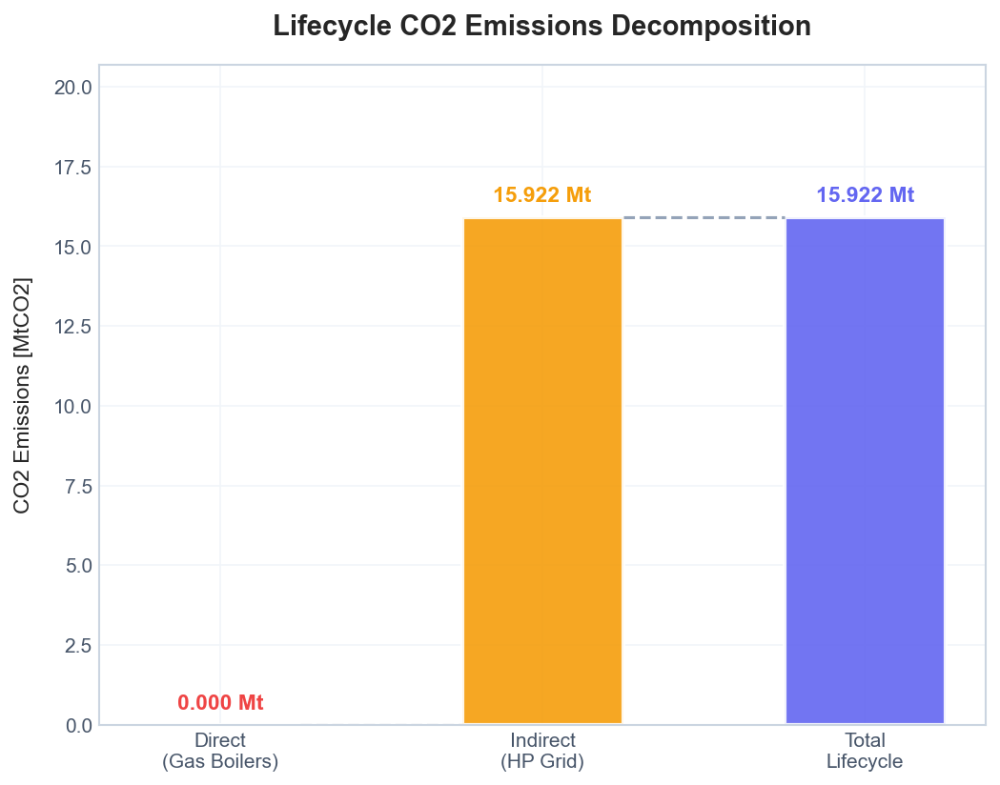

# Project 14: German Heat Decarbonization FINE-MGA

*Spatially-differentiated German heat sector decarbonization using ETHOS.FINE, Empirical Acceptance Constraints, and Modelling to Generate Alternatives (MGA).*

---

## 🌍 Overview

This project provides a highly resolved, empirically grounded optimization model of the German heating sector towards the 2045 climate neutrality target. It bridges the **ETHOS.FINE** energy system modeling framework with **Modelling to Generate Alternatives (MGA)** to explore socially feasible decarbonization pathways.

By moving beyond simple "cost-optimal" system designs, this pipeline quantifies the **price of social acceptance** across 400 German districts (NUTS-3/Kreise).

### Core Methodological Pillars:
1. **Climatic Fidelity:** High-resolution historical weather data via the Open-Meteo ERA5 API.
2. **Geographic Nuance:** Machine-learning-based clustering of 400 districts into 5 socio-economic archetypes.
3. **Infrastructural Reality:** Official German standard load profiles (BDEW) generated via `demandlib` to capture non-linear thermal mass dynamics.
4. **Social Acceptance:** A bespoke ML-derived acceptance matrix mapping empirical features (e.g., density, fossil fleet, GDP, PM2.5) to penalty/bonus constraints in the optimization solver.

---

## 🗺️ Spatial Archetype Clustering

Using K-Means clustering on empirical district-level data, the 400 German Kreise were segmented into 5 distinct archetypes, each facing unique decarbonization constraints (e.g., District Heating pipe costs, heat pump COP variations, fossil lock-in):





### Archetype Summary

| Archetype | Count | Heat Share | DH Premium | Mean Temp | HDD |
| :--- | :---: | :---: | :---: | :---: | :---: |
| **Metropolitan** | 81 | 37.3% | €827/kW | 12.0°C | 2435 |
| **Suburban** | 45 | 6.8% | €1,393/kW | 10.9°C | 2719 |
| **Rural-Dense** | 125 | 29.7% | €2,724/kW | 10.9°C | 2708 |
| **Rural-Sparse** | 99 | 15.4% | €2,832/kW | 10.7°C | 2812 |
| **Industrial** | 50 | 10.8% | €2,458/kW | 10.9°C | 2753 |

---

## ⚖️ The Social Feasibility Frontier

Traditional models stop at the absolute cost minimum. This framework leverages the **MGA (Modelling to Generate Alternatives)** algorithm inside ETHOS.FINE to relax the cost objective slightly (e.g., +1% to +10%) and heavily maximize a proxy index for **Social Acceptance**.

> **Key Insight:** The socially optimal pathway costs just **~1%** more (+€260M) than the pure cost-optimum (€25.27B), but achieves a substantial structural shift in social acceptance, replacing unpopular fossil lock-in with highly accepted biomass and specialized district solutions in sensitive archetypes.





### Feature-Driven Acceptance Matrix
The acceptance parameters used to generate the frontier are mapped from 9 real-world features (renewable heating share, air quality, GDP, rurality, etc.):

| Archetype | Air HP | District HP | Gas Boiler | H₂ Boiler | Biomass | Gas Lock-In |
| :--- | :---: | :---: | :---: | :---: | :---: | :---: |
| **Metropolitan** | +0.71 | +0.87 | -0.79 | +0.35 | -0.05 | 0.297 |
| **Suburban** | +0.66 | +0.81 | -0.74 | +0.36 | -0.01 | 0.280 |
| **Rural-Dense** | +0.66 | -0.14 | -0.79 | -0.12 | +0.84 | 0.263 |
| **Rural-Sparse** | +0.72 | -0.16 | -0.82 | -0.01 | +0.90 | 0.272 |
| **Industrial** | +0.90 | +0.08 | -0.90 | +0.45 | +0.78 | 0.347 |

---

## 📊 Techno-Economic & Emission Results

The pipeline generates comprehensive decompositions of system costs, capacity mix variations, and emission waterfalls.

### Empirical Validation
The transition from synthetic sinusoids to real ERA5-based non-linear thermal mass dynamics captures the true intra-day peaking behavior.



### Cost Decomposition
Transitioning from fossil-heavy baselines to electrified/district systems shifts OPEX (fuel) heavily into CAPEX (equipment/infrastructure).



### Emissions Waterfall
Tracing the marginal emission abatement step-by-step from the baseline to the 2045 optimized target state.



---

## 🛠️ Usage & Architecture

### Environment Setup
Requires `ETHOS.FINE`, `demandlib`, and `openmeteo-requests`.
```bash
uv pip install -r requirements.txt # (or pip install)
```

### Execution
The entry point orchestrates data fetching, matrix transformation, FINE model build, solver execution, and MGA iteration.
```bash
python verify_model.py
```

All empirical plots and CSV artifacts are automatically written to the `results/` directory.

---
*Developed as part of an advanced Python/Operations Research modeling portfolio.*
